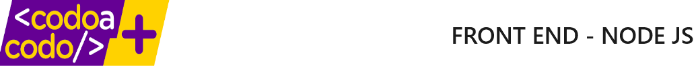

#### Author
Sabrina Lucero  
Nicolas Mazzitello  
Juan Camilo Monina  
Fabian Sarmiento  
2024

# Consulting software company

## Descripción
Este proyecto es una plataforma web para la gestión de una empresa de consultoría. 

## Características
- Presentación de proyectos
- Presentación de tecnologías

## Tecnologías utilizadas
- Frontend: HTML, CSS, Javascript
- Otras herramientas utilizadas: Git, Github, VSCode

## Instalación 

## Contribución

### Licencia 

MIT License

